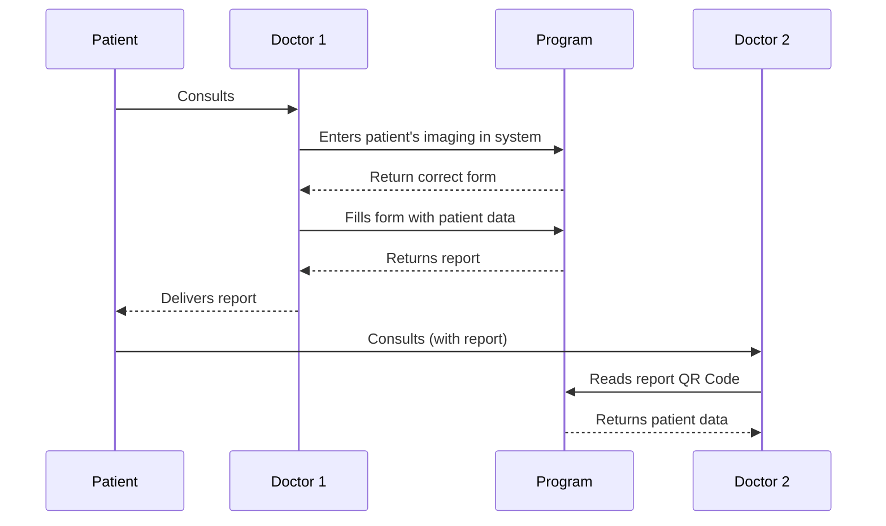

# ISARVIT 👩‍⚕️ 
##### An open-source medical report generator

 [](https://codecov.io/gh/AndreisPurim/ISARVIT)

ISARVIT is based on work originally called "ISARVIT" - developed based on ICIPEMIR ([PubMed: 34042778](https://pubmed.ncbi.nlm.nih.gov/34042778/)) - that I helped develop (with a team) while participating in research and development work at the École Centrale de Lille between 2020 and 2022. I later adapted and improved parts of the system at UNICAMP, incorporating lessons from MC426 (Software Engineering) in 2023. This repository is a revival of those older documents and prototypes, intended as a starting point that others can adapt, study, and reuse. Especially, the SE documents from MC426 are still stored in the Documentation folder.

The current version can run as a frontend-only demonstration using mock data from `dbExample()`. For the demo login, use:

```text
Email: andreis@example.com
Password: 123
```

## Technical Details
  

This project is split into two modules: **Frontend** and **Backend**.

The frontend is a React and Material UI single-page application. It can run independently with mock data for demos, or communicate with the backend through HTTP APIs when the backend is available.

The backend is a FastAPI service with database models for users and forms.

Clone the repository:

```bash
git clone git@github.com:AndreisPurim/ISARVIT.git
```

## Frontend

Install the frontend dependencies:

```bash
cd Frontend
npm install
```

Run the frontend locally:

```bash
npm start
```

Build the frontend:

```bash
npm run build
```

Deploy to GitHub Pages:

```bash
npm run deploy
```

The deploy command publishes the built frontend to the `gh-deploy` branch.

## Backend
 
Create a virtual environment:

```bash
cd Backend
python -m venv fastapi-env
```

Activate it on Windows via PowerShell:

```powershell
fastapi-env\Scripts\Activate.ps1
```

Activate it on Windows via Command Prompt:

```bat
fastapi-env\Scripts\activate.bat
```

Activate it on Linux/macOS:

```
source fastapi-env/bin/activate
```

Install the dependencies:

```
pip install -r requirements.txt
```

or

```
pip3 install -r requirements.txt
```

Create the database tables:

```
python3 cria_tabelas.py    
```

Run the backend:

```
uvicorn main:app --reload 
```

Run the backend tests:

```
python -m pytest tests/
```


## Diagrams

> **New ideas:** contact the administrators



## Architecture

### Architecture Style

> **Single Page Application** - The frontend is designed as a SPA to keep navigation simple and fluid. The page loads once, and React updates the active view as the user moves through login, profile, form creation, form filling, and report generation.

> **RESTful APIs over HTTP** - The backend exposes HTTP endpoints for users and forms. This keeps the frontend/backend boundary explicit and makes it possible to run the frontend with mock data when the backend is not available.
 
### Design Pattern

> **Observer-style state updates** - The frontend relies on React state and hooks. Components respond to state changes, which keeps the interface reactive without requiring manual DOM updates.

### Main Components and Responsibilities

- **TypeScript and React**: Build the frontend interface, manage the SPA state, and render reusable components for authentication, profiles, form creation, form filling, QR code reading, and report export.
- **Material UI**: Provides the frontend component library used for cards, buttons, dialogs, tables, forms, steppers, and layout.
- **FastAPI**: Provides the optional backend API for users and forms.
- **Ormar and SQLAlchemy**: Define and manage the database models used by the backend.
